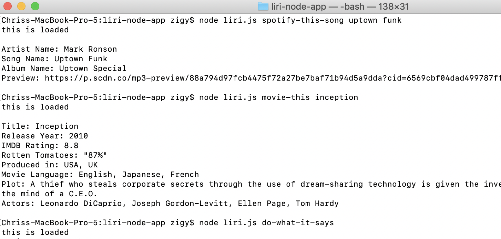
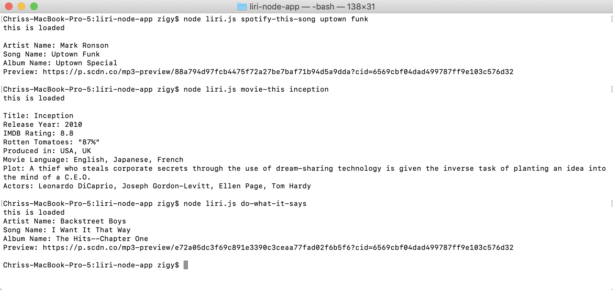

# liri-node-app

## Created and maintained by Chris Zeigler

**Goal:**
To demonstrate how to interact with APIs using the command line. 

**Tools Used:**
* Node.JS
* VS Code
* Spotify and OMDB APIs
* Axios
* File Systems

-----------------------------
-----------------------------

Welcome to LIRI! This project is a Command Line Interface App that allows you to use commands to retrieve data from APIs and then display them on the console/terminal. LIRI is currently connected to the Spotify API and the OMBD API. 

This app takes in two commands with an argument after each command. The commands are "spotify-this-song" and "movie-this".  For example: if I wanted to find more information about the song "Uptown Funk" by Bruno Mars, I can enter this command into the command line: 

    node liri.js spotify-this-song uptown funk 
Example:

What returns is the Song Name, Artist, Album Name, and a preview URL so I can listen (not all songs have a preview available).

To search for more information about a movie, I can enter this command:

    node liri.js movie-this <insert movie title here>
  
What returns is information about that particular movie such as release year, rotten tomatoes rating, actors, plot, etc. 

-----------------------------
-----------------------------

Explore and have fun! If you have any questions, feel free to email me at zigybass@gmail.com and thanks again!

